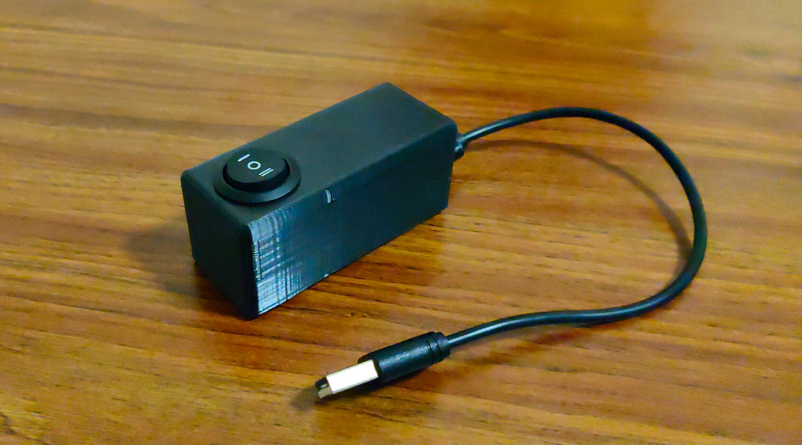

# nodemcu-weightselector
A (very) simple (yet somehow overcomplicated) button to select who stepped on a scale.

# Submodules beware

This repo has submodules, notably [nodemcu-scaffold](https://github.com/skrewz/nodemcu-scaffold), and chained therefrom, [nodemcu-libs](https://github.com/skrewz/nodemcu-libs).

You should thus **clone with git's `--recursive` flag**.

# How does this work?

This is pretty specific to my use case. Two people (cleverly named `user1` and `user2`) have each their side of a flipbutton, and an independent system publishes a raw float value (in kilogrammes) onto the MQTT topic `datainput/bathroom/scale/raw`. In turn, this device's **only goal in life is to interpret this relative to the state of the button, and re-publish accordingly**.

That's a fair bit of work for something so trivial.

On the other side, another MQTT client is picking up on the published (and now labelled) JSON and putting into InfluxDB. I haven't provided the code for that.

# Getting started

## Printing

The OpenSCAD file is under the [openscad folder](openscad/). I've also put in [an STL file](openscad/weightselector_case.stl) for those of you who can't be bothered to start up OpenSCAD.

It's meant to be printed in the orientation of the model. The strips across provide some (but not great) adhesion surface for Blu-Tack'ing this to a wall or something. Dupont cables can (barely) fit inside, so **the whole thing is disassembly-friendly**.

## Building/uploading

This example is fairly self-contained. It ought to be possible to simply run `make upload` and issue a `node.flashreload("lfs.img")` from within the serial console, referring to [nodemcu-scaffold's README](https://github.com/skrewz/nodemcu-scaffold/blob/master/README.md). Of course, it'll fail horribly at connecting to my MQTT setup, etc.

You'll need the [ws2812](https://nodemcu.readthedocs.io/en/master/modules/ws2812/) and [ws2812-effects](https://nodemcu.readthedocs.io/en/master/modules/ws2812-effects/) modules for this demo, too. Those in turn require the [bit](https://nodemcu.readthedocs.io/en/master/modules/bit/) module, if memory serves.
